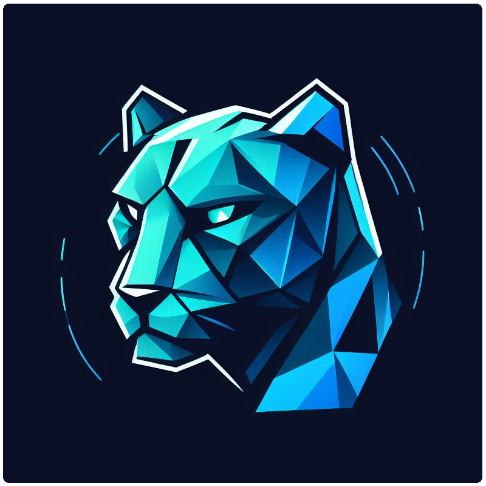

<div align="center">
 <a href="https://blockstalker.io">
  <picture>
    
 </a>
</div>

<h1 align="center">
BlockStalker.IO Client SDK (JS)
</h1>

Follow NFTs, Accounts, Apps... anything on Algorand using our JavaScript `client-js` library.  Manage your [BlockStalker.IO](https://blockstalker.io) Streams and Filters via the REST API, find items to follow via the Registry, and subscribe to your streams to receive Algorand MainNet events in real-time.

# 📦 Installation

To install `client-js`, use npm or yarn:

```bash
npm install @blockstalker/client-js
# or
yarn add @blockstalker/client-js
```

# ✅ Requirements

**Using this library requires an API Key via a [BlockStalker.IO subscription](https://blockstalker.io/pricing)**.  Visit your [account page](https://blockstalker.io/account) to generate a new API key.

# 🚀 Getting Started (in 5 Minutes)

### Hello Blockstalker

To skip the documentation and get going in minutes, clone our [Hello BlockStalker sample project](https://github.com/BlockStalker/hello-blockstalker-js).  This Javascript sample project demonstrates using the REST API (Streams, Registry, and Filters) and also the Streaming client.

```bash
git clone https://github.com/BlockStalker/hello-blockstalker-js.git
```

# 💾 Documentation

## Initialization

```javascript
import blockStalkerClient from '@blockstalker/client-js';
// We recommend using a .env file for your API Key
const apiKey = process.env.BLOCKSTALKER_API_KEY || 'YOUR_API_KEY_HERE';
const apiBaseURL = "https://api.blockstalker.io";
const client = blockStalkerClient(apiKey, apiBaseURL);
```

## REST API

The `blockStalkerClient` in `client-js` provides access to both REST and streaming functionalities. Here's how you can use the REST API:

### Streams

Streams are channels for real-time Algorand MainNet events on BlockStalker.IO.  To manage your streams, use the REST API.  To subscribe to streams and receive/handle these events, reference the streaming client documentation.

```javascript
// Fetch owned streams
client.rest.streams.owned().then(streams => {
    console.log(streams);
});

// Create a new stream
client.rest.streams.create().then(stream => {
    console.log(stream);
});

// Delete a stream by ID
client.rest.streams.delete('ABC-YOUR-STREAM-GUID-HERE-123').then(stream => {
    console.log(stream);
});

// Update a stream configuration
const streamConfig = {
    id: 'ABC-YOUR-STREAM-GUID-HERE-123';
    // Optional Fields to set
    name: 'Custom Stream Name';
    description: 'My Custom Stream';
    isPublic: true;
};

client.rest.streams.update(streamConfig).then(stream => {
    console.log(stream);
});
```

### Registry

The BlockStalker.IO Registry holds the associations between `Key`, `KeyGroup`, and `KeyType`, along with some other basic metadata.  Fundamentally, a `Key` is either an Algorand Account (Wallet Address), an Asset Id, or an Application Id.  Looking an item up in the Registry can make it easier to create Filters.

```javascript
// Lookup by key (Wallet Address, Asset Id, Application Id)
const key = '31566704'; // USDC, Asset Id = 31566704
client.rest.registry.lookup(key).then(item => {
    console.log(item);
});
```

### Filters

Filters give developers precise control over which events to receive through streams.  Filters are created based on the [Event Integrations supported](https://blockstalker.io/integrations) on BlockStalker.IO.

#### Creating a Filter

Creating a new filter is easy by using the `FilterFormBuilder` provided in the `client-js` library.  Import it along with your `blockStalkerClient`.  A few extra type imports are provided below that aid in filter creation.

```javascript
import { blockStalkerClient, FilterFormBuilder, NumericCondition, KeyEvent, KeyGroup } from '@blockstalker/client-js';

const personalStream = "ABC-YOUR-STREAM-GUID-HERE-123";
// Create a filter for any USDC (Asset Id = 31566704) transfer over 5 USDC
const usdcFilter = new FilterFormBuilder()
    .keyFilter('31566704', KeyEvent.AssetXfer)
    .stream(personalStream)
    .amount(5, NumericCondition.GreaterOrEqual)
    .build();

client.rest.filters.create(usdcFilter).then(filter => {
    console.log(filter);
});
```

#### Other Filter Operations

```javascript
// Get Filters by Stream
client.rest.filters.getByStream('ABC-YOUR-STREAM-GUID-HERE-123').then(filters => {
    console.log(filters);
});

// Enable & Disable a Filter
client.rest.filters.enable(123).then(response => {
    console.log(response);
});

client.rest.filters.disable(123).then(response => {
    console.log(response);
});

// Delete Filter
client.rest.filters.delete(123).then(response => {
    console.log(response);
});
```

## Streaming Client

The streaming client enables developers to receive real-time [stream events](https://blockstalker.io/integrations) from BlockStalker.IO. Example:

```javascript
// Handle your streaming events here
function handleEvent(event) {
    console.log(event);
}

// Connect & Subscribe
const personalStream = 'ABC-YOUR-STREAM-GUID-HERE-123';
const streamConnection = client.streaming.events(handleEvent, [personalStream]);

// Manual Subscribe/Unsubscribe
await streamConnection.invoke("Subscribe", { stream: personalStream, apiKey: apiKey });
await streamConnection.invoke("Unsubscribe", { stream: personalStream, apiKey: apiKey });
```

# ⚙️ Development

## Local Build & Testing

Run `npm link` on the `client-js` root, then run `npm link @blockstalker/client-js` in any package source where you want to use the locally developed `client-js` library.
For build & test iteration, run `npm run build` on `client-js`.